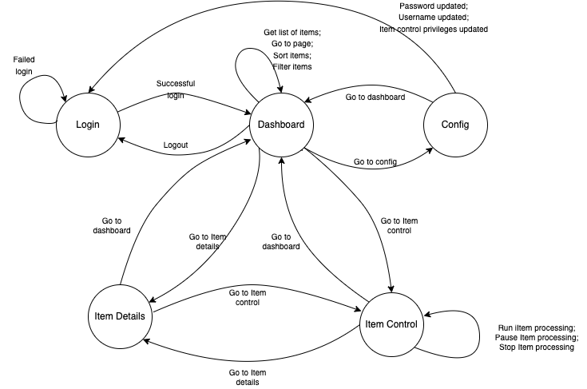

**Disclaimer**: in real-life situation I would prefer to clarify specification with stakeholders (i.e. what are "requests to 
change the state of the system" supposed to be, what are security requirements etc).

1) State transition diagram: 
2) Rest API: [YAML swagger description](api_descr.yml)
3) Tests are in tests/ directory